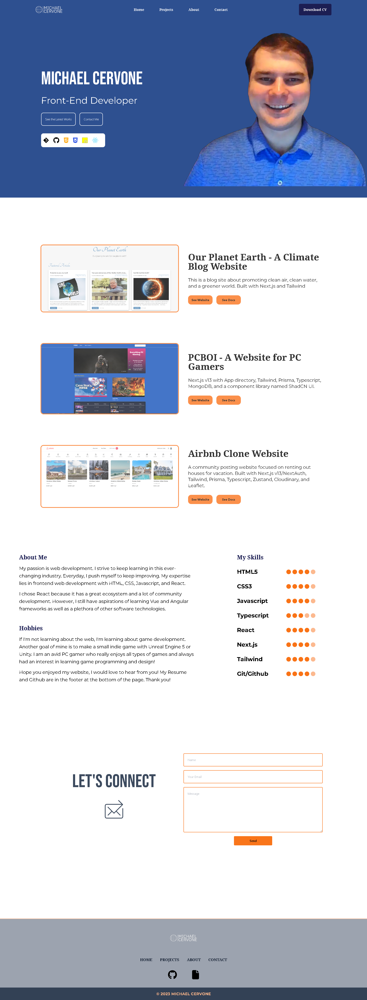

<h1>Portfolio</h1>

## Table of Contents

- [Table of Contents](#table-of-contents)
- [Overview](#overview)
- [Built With](#built-with)
- [Purpose](#purpose)
- [Contact](#contact)

## Overview

Link to website - [Portfolio](https://michaelcervone.com/)

My portfolio was a nice starter project and a great learning experience. The challenges of designing a nice looking portfolio page is still one that I am trying to get "right", but with each redesign it is getting better and better. Overall, this was a necessary project to showcase my skills and projects in front-end web development.

## Built With

- [Next.js](https://nextjs.org/)
- [Tailwind](https://tailwindcss.com/)
- [Hosted on Vercel](https://vercel.com/)

## Purpose

The purpose of this project was to create a portfolio website to showcase my skills and projects.

## Contact

- [Github](https://github.com/MCervone14)
